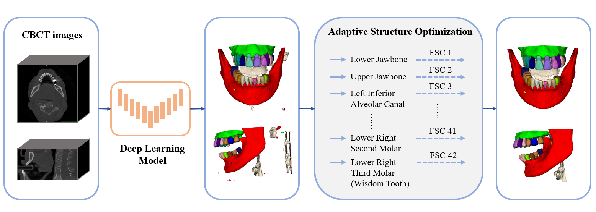

# Multi-Structure Segmentation for MICCAI 2024 ToothFairy2 Challenge
Solution for [MICCAI 2024 ToothFairy2 Challenge](https://toothfairy2.grand-challenge.org/) based on nnUNet.



## Environments and Requirements:
### 1. nnUNet Configuration
Install nnUNetv2 as below.  
You should meet the requirements of nnUNetv2, our method does not need any additional requirements.  
For more details, please refer to https://github.com/MIC-DKFZ/nnUNet  

```
git clone https://github.com/MIC-DKFZ/nnUNet.git
cd nnUNet
pip install -e .
```
### 2. Dataset

Load ToothFairy2 Dataset from https://ditto.ing.unimore.it/toothfairy2/

Unzip the dataset and put it under *nnUNet_raw* folder.

Replace *dataset.json* by *preprocess/dataset.json* .

### 3. Preprocessing

Prepare the dataset.

```
python preprocess/preprocess.py --input_root YOUR_nnUNet_FOLDER/nnUNet_raw/Dataset112_ToothFairy2
```

Filter out the suboptimal images and annotations (Optional, if so, modify numTraining in *dataset.json*).

Conduct automatic preprocessing using nnUNet.

```
nnUNetv2_plan_and_preprocess -d 112 --verify_dataset_integrity
```

### 4. Training

Train by nnUNetv2 with 5-fold cross-validation method. 

Run script:

```
sh train.sh
```

### 5. Adaptive Structure Optimization

To get the optimal filtering size, do:

```
python utils/ASO.py --gt_root GROUND_TRUTH_FOLDER --pred_root EVALUATION_RESULT_FOLDER
```

### 6. Final Model Encapsulation using Docker

Move the checkpoint_best.pth for each fold to *weight*.

Or you can get the trained model weights from https://drive.google.com/file/d/1OXf4JAugFRThhNCdnnALLivzhRi34eGE/view?usp=sharing

Build the docker based on `dockerfile`

```
sh build.sh
```
Save the docker images if needed.
```
sh export.sh
```
