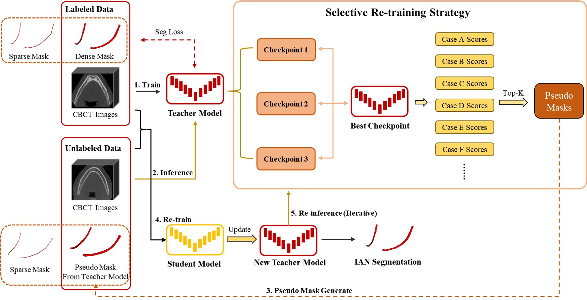

# SSL-IAN-Retraining for MICCAI FAIRY2023 Challenge
Champion Solution of [MICCAI FAIRY2023 Challenge](https://toothfairy.grand-challenge.org/) based on Self-training with Selective Re-training.

**Inferior Alveolar Nerve Segmentation in CBCT images using Connectivity-Based Selective Re-training**  
_Yusheng Liu(lys_sjtu@sjtu.edu.cn), Rui Xin(xr1999@sjtu.edu.cn), Tao Yang(yangtao22@sjtu.edu.cn) and Lisheng Wang(lswang@sjtu.edu.cn)_

Institute of Image Processing and Pattern Recognition, Department of Automation,  
Shanghai Jiao Tong University, Shanghai 200240, People’s Republic of China  

The pipeline of the proposed segmentation framework is shown in Figure below.  
We adopt nnUNet as the basic network models for IAN segmentation.   
Self-training method is adopted for semi-supervised semantic segmentation.  
In addition, a connectivity-based selective re-training strategy is designed to screen more plausible pseudo-labels.  



## Environments and Requirements:
### 1. nnUNet Configuration
Install nnU-Net as below.  
You should meet the requirements of nnUNet, our method does not need any additional requirements.  
For more details, please refer to https://github.com/MIC-DKFZ/nnUNet  
```
git clone https://github.com/MIC-DKFZ/nnUNet.git
cd nnUNet
pip install -e .
```
### 2. Pipeline of the Proposed Framework
#### 2.1. Dataset Load and Reconstruction
Load ToothFairy Dataset from https://ditto.ing.unimore.it/toothfairy/
```
python process/data_read.py
├── img
├── DenseMask
└── SparseMask
```
Filter out densely-labeled data with more than 2 connected domains.  
```
python process/Check_Component.py
```
Filter out the data with DSC lower than 0.85 (if you have trained the model using original dataset and have the weight) , and only select the data with definite boundaries.
```
python process/select_fineGT_series.py
```
#### 2.2. Model Training from the Preprocessed Dataset
First of all, add codes in line 486 of nnUNet-master/nnunet/training/network_training/network_trainer.py to save the checkpoints over 1/3, 2/3, 3/3 total iterations during training
```
if (self.epoch + 1) in [int(1 / 3 * self.max_num_epochs), int(2 / 3 * self.max_num_epochs),int(self.max_num_epochs-1)]:
self.save_checkpoint(join(self.output_folder, str(self.epoch + 1) + '.model'))
```

Conduct automatic preprocessing using nnUNet and train the Teacher(or Student) Model.
```
nnUNet_plan_and_preprocess -t 100 --verify_dataset_integrity
nnUNet_train 3d_fullres nnUNetTrainerV2 100 all
```
#### 2.2. Selective Re-training Strategy
Do Inference with the model which owns saved checkpoint weights.
```
sh process/nnUNet_Pseudo_Generate.sh
```
Regard the top 100 images with the highest score and the number of connected domains as 2 with a meanDice score greater than 0.9 as reliable images, and the rest as unreliable images.
```
python process/select_reliable_series.py
```
After that, we use the original labeled data and pseudo-labeled data to jointly supervise the training of the student model, and update the student model to a new iteration of the teacher model.  
In the challenge, we first reconstruct the training set as 111 labeled images and 332
unlabeled images.   
Then, we performed two pseudo-label update iterations, training the final model with 111
labeled data and 200 pseudo-labeled data.

### 3. Final Model Encapsulation using Docker
Build the docker based on `dockerfile`
```
sh build.sh
```
Run the docker container to test the final model.
```
docker container run --ipc=host -it --rm --gpus "device=1" --name fairy_nnunetv2 -v /media/ps/lys/CBCT_IAN/Fairy_Tooth/docker/model_generic_unet/   input:/input -v /media/ps/lys/CBCT_IAN/Fairy_Tooth/docker/model_generic_unet/output:/output toothfairy_generic:v1.0
```
The inference process and information (weight path, data info, TTA) could be modified in `test.py`.  
Finally, save the docker images if needed.
```
docker save -o fairy_docker_v0.tar.xz fairy_docker:v0
```
## Citations (Updating)
If you find this repository useful, please consider citing our paper:  
```
@misc{liu2023inferior,
      title={Inferior Alveolar Nerve Segmentation in CBCT images using Connectivity-Based Selective Re-training}, 
      author={Yusheng Liu and Rui Xin and Tao Yang and Lisheng Wang},
      year={2023},
      eprint={2308.09298},
      archivePrefix={arXiv},
      primaryClass={cs.CV}
}
```
